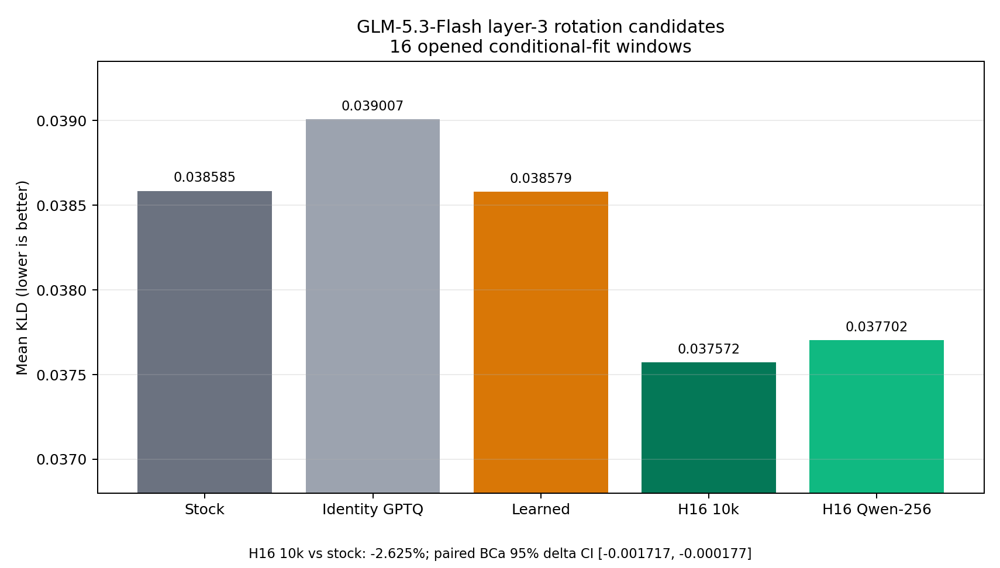

# GLM-5.3-Flash in-block H16 and ShapleyMCG KLD experiment

This repository is the reproducible code-and-evidence record for a local
GLM-5.3-Flash BF16-to-NVFP4 experiment on four RTX PRO 6000 Blackwell GPUs.
It tests block-local 16-by-16 Hadamard transforms inside every routed-expert
projection, calibrated GPTQ, and a later 6-bpw ShapleyMCG global allocation.

The campaign is still in progress. The strongest valid result as of
2026-09-03 is a **2.625% reduction in end-to-end KLD** after replacing only
routed MoE layer 3 with the fixed-H16 candidate:

| Endpoint | Mean KLD | Change vs same-loader stock | Paired BCa 95% CI for candidate minus stock | Status |
|---|---:|---:|---:|---|
| Stock NVFP4, InstantTensor/Humming | 0.0385846920 | reference | — | valid control |
| Fixed H16, all projections, 10k calibration cap, layer 3 only | 0.0375717123 | **-2.625%** | [-0.00171749, -0.00017658] | qualified conditional-fit pass |
| Exact Qwen recipe, 256 samples/expert, layer 3 only | 0.0377024045 | -2.287% | [-0.00206005, +0.00058266] | mean improved; interval crosses zero |
| Learned block rotation, all projections, layer 3 only | 0.0385788029 | -0.590% against its stock anchor | [-0.00229439, +0.00114439] | did not qualify |

Lower KLD is better. These are 16-window conditional-fit measurements with
20,000 paired bootstrap replicates. They are not yet a full-model or final
holdout claim.



## What is established

- The exact Qwen block-H16 transformation is implemented per tensor family:
  `R_in` is shared by gate/up, `R_mid` is separate for down, weights use
  `W R`, Hessians use `R^T H R`, and runtime activations receive the matching
  transform inside the MoE execution path.
- Fixed H16 is the only rotation family with a statistically qualified GLM
  improvement so far.
- The learned candidate was significantly worse than fixed H16 in the direct
  comparison: learned minus H16 KLD was +0.00100709 with BCa 95% CI
  [+0.00013188, +0.00196291].
- Increasing the calibration cap from the exact-Qwen 256 samples/expert to
  10,000 did not produce a distinguishable difference on this layer.
- The earlier catastrophic H16 result was invalid. A sparse overlay index was
  used with the ordinary safetensors loader, allowing later carrier shards to
  overwrite redirected tensors. Version-2 overlays now fail closed unless
  loaded by InstantTensor.

## Why this is not yet the Qwen-sized gain

The earlier Qwen result was a **full-model recipe compared with a stock RTN
NVFP4 checkpoint**: -29% on the final panel, -36% on selection, and -9% on
WikiText at the same routed-weight rate. It combined REAP calibration, GPTQ,
fixed H16, and every routed layer. The present GLM winner changes only layer 3
while the other 41 routed layers remain stock. Its 2.625% end-to-end effect is
therefore not an apples-to-apples estimate of the completed full-model gain.

The live next tests are:

1. the exact-Qwen fixed-H16 recipe across all 42 routed layers at stock NVFP4
   rate, followed by a fresh selection wave; and
2. fixed-H16 NVFP4/MXFP6 candidates with Shapley global allocation constrained
   to 6 bpw, followed by equal-cost controls and confirmation.

No 10-30% GLM improvement has been measured yet. That range remains a
hypothesis until the full-model run completes.

## Repository map

- `glm53_nvfp4/`: GLM quantization, rotation, evaluation, freezing, and
  attribution implementation.
- `runtime_patch/`: fail-closed Humming/InstantTensor and B12X MXFP6 runtime
  transforms.
- `scripts/`: exact launch and campaign scripts.
- `tests/`: unit and receipt-verifier tests.
- `evidence/opened/`: raw JSON for already opened conditional-fit results.
- `evidence/historical/`: complete KLD run and runtime-session receipts,
  including superseded and invalidated diagnostic attempts.
- `results/current-kld-summary.json`: compact machine-readable result table.
- `docs/REPRODUCIBILITY.md`: exact identities, replay commands, and exclusions.
- `evidence/MANIFEST.sha256`: content hashes for the published evidence set.

## Quick verification

```bash
python3 -m pytest -q
python3 scripts/verify_public_evidence.py
python3 scripts/plot_current_kld.py
```

The first published snapshot passed 39 tests. Large model weights, teacher
logits, JIT caches, quantized checkpoints, raw calibration records, and
unopened holdout inputs are deliberately not stored in Git. Their immutable
identities and acquisition/replay requirements are documented instead.

## License and attribution

This work is **source-available**, not OSI open source. It is distributed under
the ShapleyMCG License 1.0 in `LICENSE`. Required attribution:

> ShapleyMCG was created by Brandon M. Music. Canonical source:
> https://github.com/brandonmmusic-max/shapleymcg

Third-party models, runtimes, and libraries remain under their own licenses.
See `THIRD_PARTY_NOTICES.md`.
