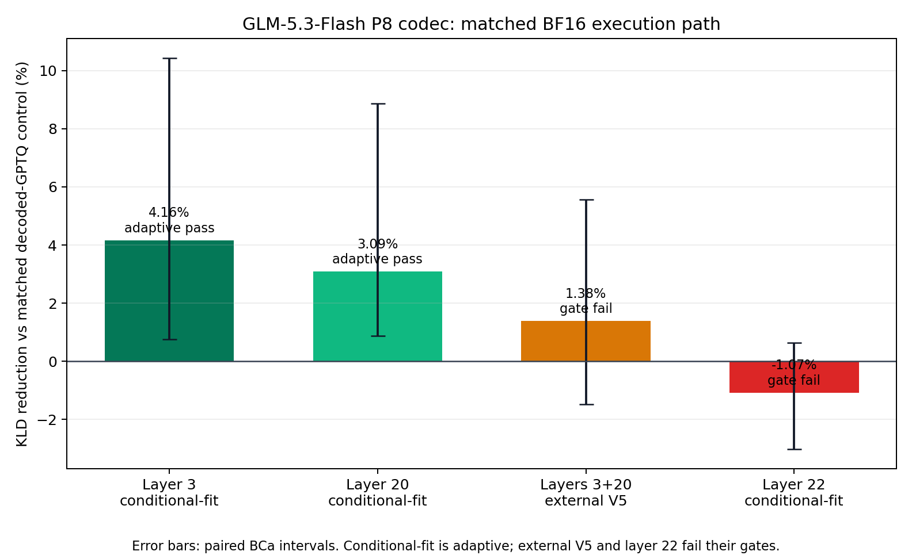
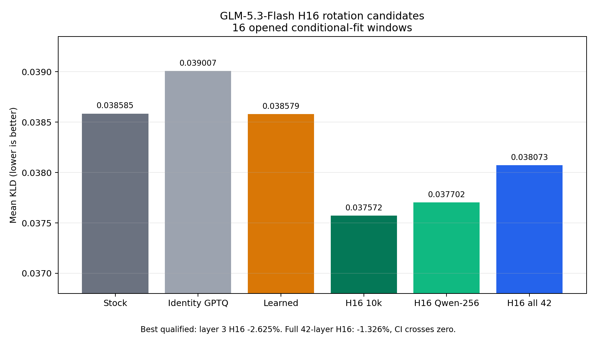
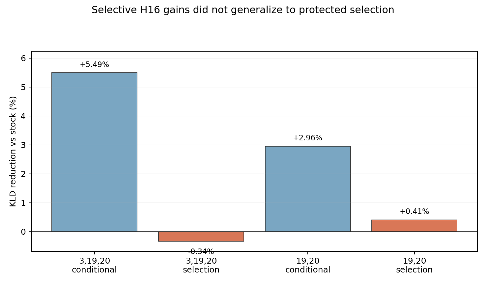

# GLM-5.3-Flash in-block H16 and ShapleyMCG KLD experiment

This repository is the reproducible code-and-evidence record for a local
GLM-5.3-Flash BF16-to-NVFP4 experiment on four RTX PRO 6000 Blackwell GPUs.
It tests block-local 16-by-16 Hadamard transforms inside every routed-expert
projection, calibrated GPTQ, and a later 6-bpw ShapleyMCG global allocation.

The campaign is still in progress. The strongest conditional-fit result as of
2026-09-03 is a **5.493% reduction in end-to-end KLD** for routed MoE layers
3, 19, and 20, but that adaptive result did not generalize: the pre-frozen
candidate was 0.339% worse on its untouched selection wave. The independent
pre-frozen runner-up (layers 19 and 20) improved its untouched wave by only
0.407%, with a confidence interval crossing zero. Therefore **no selective or
uniform H16 candidate has a qualified protected-selection win on GLM**.

### Full-model native P8 result (2026-09-05)

The uniform all-42-routed-layer P8 checkpoint completed its first native
end-to-end measurement: **KLD 0.0400214** on all 32 conditional-fit windows,
BCa 95% CI `[0.0337782, 0.0482526]`. The audit verified all 168 layer/rank
forward paths and 65,504 causal positions. Payload is 4.25 bpw; no LDLQ was used.
It is **24.96% lower than the historical contextual comparator** (28/32 wins),
but that comparator differs in bitrate, quantization coverage and EP/DCP
topology, so this is **not a matched NVFP4 or protected-quality win**.
P8 uses twice NVFP4's MMA issue count. The repaired five-cold-run product
comparison measured **+11.00% 32K prefill but -77.33% C1 decode** versus the
existing EXL3 serving topology. It failed the predeclared two-metric gate, so
the allocation game is stopped. This is a different-topology system result,
not codec-only causality. See the [KLD report](results/P8_FULLMODEL_CF32.md)
and [speed report](results/P8_SPEED_V2A3.md).

The follow-on four-rank Nsight trace confirms that C1 used FULL CUDA-graph
replay and true M1 execution. The fused TrellisMX MoE kernels consume about
39.3-39.5 ms of a 47.6 ms graph on the two critical ranks (82.6-83.0%); explicit
fills consume only 0.69-0.83 ms and the separate top-k reduction about 0.03 ms.
The next runtime candidate ports B12X's small-M route/slice scheduling geometry
while retaining P8's MCG-to-E4M3 Tensor Core arithmetic and deterministic
reduction. See the [decode attribution report](results/P8_DECODE_NSYS_V1.md).

That first opt-in M1 port now compiles and is bit-exact to the frozen baseline.
On a single-GPU identical-workload layer call, 20 warmups plus 100 CUDA-event
samples measured 1.134288 ms baseline versus 0.313248 ms candidate: **72.38%
lower device time (3.62x)**. M2/M3 fallback hashes also match exactly. This is
developmental eager kernel evidence, not CUDA-graph serving tokens/s; captured
four-rank integration is recorded separately below. See the
[first device report](results/P8_SMALLM_DEVICE_V1.md).

The subsequent integrated small-M diagnostic reached **75.5962 C1 tokens/s**,
up from 20.6937, with all 42 layers on the native P8 path and FULL graphs.
It still trails the fixed EXL3 serving reference of 91.2645 tokens/s; allocation
remains stopped. No new full-model KLD is claimed for this schedule change.
The follow-on trace's strict count gate failed on trailing capture records;
its separately labeled 16-complete-replay diagnostic localizes about **5.0 ms
to FC1 versus 0.52 ms to FC2**, with a 12.97 ms distributed graph span. FC1 is
the next optimization target. See the [integrated result](results/P8_SMALLM_INTEGRATED_V1.md)
and [trace with preserved exclusions](results/P8_SMALLM_PROFILE_V1.md).

The subsequent B12X-derived N64 FC1 / consolidated scratch-clear pilot reached
**100.5667 C1 tokens/s**, with 7,244 tok/s server-validated 32K prefill.
This is a single-run diagnostic, 33.03% above the preceding P8 pilot and
10.19% above the historical EXL3 decode median, not a completed product gate.
The separate fresh five-cold-run-per-arm comparison is in progress; historical
samples do not enter its medians. The earlier failed comparison remains valid
for its older runtime. See the [N64 pilot receipts](results/P8_FC1_INTEGRATED_V1.md).
Allocation remains stopped pending speed and full-model M1 numerical closure.
Ordinary prompt-prefill KLD exercises the unchanged M>1 fallback, so the closure
endpoint is built and CPU-reviewed to replay every conditional-fit causal row with M1
under the same Model Runner V2/FULL-graph configuration. Its capture overhead
must never be used for throughput claims. P8 remains the E4M3 compute product
with twice NVFP4's MMA issue count, not the P4/NVFP4 speed-class endpoint.
The [forced-M1 protocol](results/P8_FORCED_M1_PROTOCOL_V1.md) documents the
pending real-device canary, full-panel capture and paired KLD analysis.

### Earlier codec redesign results (2026-09-04)

The no-LDLQ P8 redesign now has a matched-path numerical gate. Its encoder
keeps the native 16x16 trellis layout, uses full-Hessian GPTQ-style error
feedback between groups with static within-group activation order, and refits
K32 UE8M0 scales with the Viterbi codes. On 16 held-out experts it improved
routed gate/up projection NMSE by **14.95%** versus GPTQ NVFP4 (16/16 wins),
and the causal gate/up/SwiGLU/down screen improved full-expert NMSE by
**11.87%** (15/16 wins). Layers 19 and 20 independently reproduced the local
causal NMSE effect at **16.52%** and **16.74%**, each with 16/16 expert wins.
Layer 22 produced the strongest local result: **17.07%** lower causal
full-expert NMSE with 16/16 wins after an exact full-activation recapture.

An earlier KLD comparison was invalid for encoder attribution because it put
the BF16 candidate against a packed-NVFP4/Humming control. After decoding the
GPTQ control to BF16 and putting both arms through the identical
InstantTensor/framework path, per-layer conditional-fit attribution found a
**4.157% KLD reduction at layer 3** and **3.086% at layer 20**; both
Bonferroni-adjusted intervals excluded zero. Layer 19 was a null. The combined
layer-3/20 subset then reduced mean KLD by only **1.383%** on all 63 balanced
V5 windows, with BCa 95% CI `[-0.002496,+0.000661]`; legal and code/agentic
domain means slightly regressed. It therefore failed the preregistered 3%
external gate. These are useful developmental KLD effects, not a generalized
or protected codec win.

The preregistered matched-path end-to-end test of the strong layer-22
candidate also failed. On the domain-balanced conditional-fit n=32 panel,
candidate mean KLD was `0.0391435578` versus `0.0387275135` for decoded GPTQ:
delta `+0.0004160443`, or a **1.074% regression**, with paired BCa 95% CI
`[-0.000249,+0.001168]`. This directly shows that the large local causal-NMSE
gain is not a reliable end-to-end selection surrogate for this codec.

The subsequent scaled-H128 procedural-MCG build also failed its frozen
layer-3 gate. Its physical payload is 4.251302 bpw and its 16-expert screen
improved causal routed-output NMSE by 26.189%, but on all 32 conditional-fit
windows its matched pseudoquant mean KLD was `0.0534951744` versus
`0.0533314176` for decoded GPTQ NVFP4: delta `+0.0001637568`, or a **0.307%
regression**, with paired BCa 95% CI `[-0.002134,+0.005994]`. It improved
22/32 windows and three of four domain means; the legal domain regressed by
`+0.0058845`, dominated by `conditional-fit-0074` at `+0.0487102`. This is a
developmental null/fail, not evidence that the physical codec is worse on a
protected holdout. Confirmation logits remain unopened, and neither LDLQ nor
BlockLDLQ was used.

Expanding the local attribution to all 288 layer-3 experts confirmed that the
H128 effect was real but projection-dependent: gate and up weight NMSE
improved by **18.81%** and **19.24%** (288/288 wins each), while down worsened
by **0.94%** (116/288 wins). Full routed-expert output NMSE improved by
**28.03%** (252/288 wins). A predeclared 39-byte expert mask selected H128 for
98 experts and identity for 190; on a disjoint fit-only validation split that
hybrid improved routed-output NMSE by **13.10%** versus GPTQ NVFP4, with
201/288 wins and a BCa interval excluding zero.

That local gain still did not establish end-to-end linkage. On the already
opened conditional-fit n=32 panel, the masked 4.250443-bpw P8 codec measured
mean KLD `0.0527762731` versus `0.0533314176` for the matched 4.5-bpw decoded
GPTQ NVFP4 control: delta `-0.0005551445`, or a **1.0409% improvement**, with
paired BCa 95% CI `[-0.002402,+0.001145]`. It improved 19/32 windows but
failed the frozen `-0.0014`-nat threshold and the interval crossed zero. This
is an adaptive developmental null, not qualification; the protected 28
confirmation logits remain unopened. No LDLQ or BlockLDLQ was used.

A second redesign then optimized the actual route-weighted top-8 expert sum,
including cross-expert cancellation. A binary identity/full-H128 mask remained
a null (1.14% aggregate routed-output NMSE improvement, BCa interval crossing
zero). The evidence-motivated three-state codec—identity, full H128, or H128
gate/up with identity down—was much stronger. Its first disjoint eight-window
screen improved aggregate routed-output NMSE by **24.05%** and won 6/8, but
the BCa upper bound narrowly crossed zero. With that 104/94/90 expert policy
frozen, a powered test on all 32 remaining fit windows retained a **12.03%**
aggregate improvement and won 25/32. It nevertheless failed its uncertainty
gate: mean log ratio was `+0.04005`, BCa 95% CI
`[-0.12509,+0.35675]`, due primarily to three rare windows where decoded GPTQ
was unusually close to BF16. Code won 8/8; reasoning won only 3/8. This is the
first replicated 10–30% local effect in the GLM codec work, but it is not an
end-to-end KLD win and does not authorize a native kernel claim.

The first direct-KLD Shapley interaction pilot has now completed all eight
pre-frozen coalitions over layers 3/19/20/22, with 32 matched conditional-fit
windows per endpoint and exact window-level path efficiency. The all-P8
four-layer coalition was **2.270% worse** than decoded GPTQ, but the best
observed nonempty coalition, layers 3/20/22, was **3.097% better** (`0.0376359`
versus `0.0388389`) and won 20/32 windows. Its post-hoc paired BCa interval for
candidate minus control was `[-0.003523,+0.000498]`, so this is a promising
adaptive diagnostic rather than a qualified win. Excluding layer 19 from the
all-four context improved KLD by **5.248%**, while layer 19's two measured
contextual effects changed sign. The pilot therefore validates the need for
interaction-aware allocation, but two antithetic permutations are not enough
to claim a stable four-layer ranking and this BF16-overlay pilot is not a
native-kernel result.

The all-42 native6 execution contract is frozen in
`experiments/p8-kld-shapley-native6-v2.json`. Version 2 supersedes the
unexecuted version-1 compute statement before any native6 coalition run: the
P8 MMA consumes the physical non-unit UE8M0/32 scale plane; identity SFB is
forbidden. The design allocates 18 whole routed layers to scalar MXFP8 and 24
to 4.25-bpw P8 for 5.964286 payload bpw before container and policy metadata.
It retains 0.035714 bpw of headroom and excludes LDLQ and BlockLDLQ. The
amendment and both immutable design hashes are recorded in
`experiments/p8-kld-shapley-native6-v2-amendment.json`.

The uniform all-42-layer P8 product gate is now the execution critical path.
Its full-model KLD plan is sealed before checkpoint completion at
`experiments/p8-uniform-all42-fullmodel-kld-v1.json` (SHA-256
`86b415ad76b80adc8dd983edcf17d2c0b371b32ccc921643ed8a0e112aeb98d2`).
The chained runner verifies the complete 168-sidecar TP4 inventory, immutable
runtime patch, carrier receipt, role identity, frozen analyzer, and the
already-opened contextual-control inventory before starting one resumable
32-window conditional-fit run. It reports absolute and per-domain KLD plus
paired BCa intervals. P4 construction remains parallel CPU/static work and
does not consume the GPUs needed by this measurement.
Pre-result amendment 1 fixes an all-layer serving hazard absent from the
layer-3 BF16-overlay proof: native P8 now bypasses ModelOpt's delayed
quant-config builder after releasing carrier scales. The original plan remains
preserved; the separately sealed amendment changes only the runtime commit and
patch manifest, before the checkpoint or target KLD result existed.

The required follow-on speed gate is also frozen before the checkpoint and KLD
result at `experiments/p8-uniform-all42-tp4-vs-exl3-speed-v1.json`. It waits for
a complete finite full-model KLD run, then alternates five cold process starts
per arm in a matched target-only TP4/no-EP/DCP1 regime with B12X sparse
attention, NVFP4 MLA KV, CUDA graphs, and identical 32K/64K requests. P8 must
strictly beat the exact local EXL3 K4 checkpoint/runtime on the five-run median
of both 32K prefill and C1 32K decode. A tie or regression stops allocation;
64K cells are reported without redefining the decision.



P8 device arithmetic closure now passes for the procedural-MCG K3/K4 decoder
with physical UE8M0/32 scales and an identity activation boundary. The fresh
split/prefill run passed K3 and K4 at 33 and 64 tokens (cosine
`0.998896`–`0.998941`), and the actual 4.25-bpw layer-3 K4 payload passed at
full GLM dimensions (cosine `0.998940`–`0.998948`, relative L2
`0.045903`–`0.046079`). The former split failure was a missing mandatory K32
MMA lane permutation, now fixed and preserved as an implementation diagnostic.
This initial receipt cleared device arithmetic only. Subsequent layer-3 KLD
and deterministic device tests are described below; the later all-layer KLD
result is reported above; its later product speed failure is reported above.
The earlier W6A8 activation failure remains a negative control, and neither the uniform nor expert-masked
encoder has passed the strict matched-path end-to-end KLD claim gate.

The physical layer-3 kernel has now also completed its first end-to-end
teacher-KLD closure. On the same opened, balanced 32-window conditional-fit
role it measured `0.0539830851` versus `0.0535879281` for the exact decoded
pseudoquant carrier: delta `+0.0003951571` (`+0.7374%`), paired BCa 95% CI
`[-0.001890,+0.002988]`, with 13/32 window wins. This passes the relaxed
engineering margin (`|delta| <= 0.0014`) and proves the physical fused path is
close enough to continue. It does **not** prove that the codec beats NVFP4.
That first correctness run used the materialized dynamic arm even at small M.
The initial E=288 small-M specialization emitted non-finite values because its
logical UE8M0 scale slots pointed at one-byte sentinels. The later runtime
retains both logical and repacked physical scale planes and restored the
monolithic small-M path. The original failure remains a preserved diagnostic.
Against the already completed decoded-GPTQ NVFP4 control on the identical
windows, the physical kernel is `+0.00065167` KLD (`1.22%` worse), with BCa
95% CI `[-0.002540,+0.005982]`. That comparison is a null—not a demonstrated
loss—but it does not pass the strict quality gate.
A checkpoint-family learned 4 KiB T12 law also failed on 16 disjoint experts
(0/16 wins versus MCG), so it was stopped before another full-layer build. No
LDLQ or BlockLDLQ path is implemented or used.

The subsequent deterministic layer-3 run measured **0.0549650851** KLD over
the same 32 windows, versus **0.0535879281** for decoded pseudoquant: delta
`+0.0013771570`, paired BCa 95% CI `[-0.0005542253,+0.0039721173]`.
It met the preregistered relaxed engineering rule of an absolute mean delta
at most 0.0014 with zero inside the interval. That rule is an engineering
continuation criterion; this interval does not establish statistical
equivalence within a 0.0014 margin. Against the decoded-GPTQ context row it
was **3.0632% worse** at the point estimate, with an interval crossing zero.
This is the later runtime lineage used by the all-layer build. Five repeated
device outputs were bitwise identical for each tested monolithic/materialized
M3/M33 case. Full-model five-run bitwise determinism remains open; product
speed subsequently failed its five-cold-run gate.
Receipts: [deterministic KLD closure](evidence/opened/codec-v2/p8-native-kld-closure-v2/analysis.json)
and [contextual GPTQ comparison](evidence/opened/codec-v2/p8-native-kld-closure-v2/native-deterministic-vs-decoded-gptq-diagnostic.json).
The historical plan has an inconsistent `written_at` field; see the
[chronology caveat](experiments/p8-native-deterministic-kld-closure-v2-chronology-note.md)
for the verified local commit/run ordering and its limitations.

### Native product boundary

The physical **P8** endpoint first closed on layer 3 and has now executed on
all 42 routed layers in the completed full-model measurement described in
[P8_FULLMODEL_CF32](results/P8_FULLMODEL_CF32.md). It uses the intended fused path:
the K4 procedural-MCG stream is decoded per element in the kernel prologue,
the resulting E4M3 codes use the physical UE8M0/32 weight-scale plane, and the
matrix products execute through `mxf8f6f4`. There is no dense BF16 routed-weight
materialization or BF16 routed-weight matmul in that endpoint. Unchanged
non-routed tensors are outside this statement. This is one fused
kernel path, not one machine instruction; `mxf8f6f4` has twice the MMA issue
count of NVFP4 for the same logical K span.

The **P4** endpoint has now reached the actual GLM serving call path
structurally: an opt-in adapter replaces both routed projections after carrier
load, consumes deterministic TP4 sidecars, preserves router/shared-expert/TP
ownership, and selects a fused prologue plus `mxf4nvf4`. Its native v2 law is
RNE with signed-zero preservation, and its offline assembly contains 15
native E2M1 K64 MMA sites at 62 registers and 1,728 bytes shared memory with
zero spills. It still requires device bit-exact and arithmetic closure,
coherent generation, KLD, graph parity, determinism, and speed. Therefore the
current evidence supports native Tensor Core P8 execution on all 42 routed
layers with developmental full-model KLD, and an integrated structural P4
implementation, not yet a qualified
NVFP4-speed-class trellis product. The four-layer Shapley pilot used matched
BF16 overlays and must not be cited as native-kernel execution.

An independent CPU P4 matrix contract and deterministic GPU-probe fixture
are documented in [docs/P4_CODEC.md](docs/P4_CODEC.md). The new version specifies
the exact alpha-1 MCG, ties-to-even E2M1 projection and signed-zero semantics,
with physical positive E4M3/16 scales and a charged FP32 global scalar.
Its stream-plus-block-scale rate is 4.5 bpw; the verifier also charges the
scalar and the measured container bytes. This is structural CPU evidence
and is a distinct law from the legacy zero-canonicalizing P4 encoder.

A separate [experimental P4 implementation](docs/P4_NATIVE.md) now supplies
the E2M1/E4M3/16 prologue, double-buffered producer/MMA path, and an explicit
TP-local launch/probe seam. CPU bit-exact checks and offline SM120a ISA
inspection are recorded under `evidence/opened/codec-v2/p4-astra/`. Device
execution, integrated quality and speed remain untested; P8 is unchanged.

The independent contract mismatch is preserved in
[docs/P4_RECONCILIATION_AUDIT.md](docs/P4_RECONCILIATION_AUDIT.md). It is now
resolved by the versioned six-tensor bridge and GLM adapter documented in
[docs/P4_GLM_SERVING.md](docs/P4_GLM_SERVING.md). The composed CPU/static suite
passes 185 tests, including an exhaustive 65,536-state law check and actual
`RoutedExperts.forward_modular` host-path execution. The exact merge decisions,
receipts, and remaining device gates are recorded in
[docs/P4_V2_INTEGRATION_RECONCILIATION.md](docs/P4_V2_INTEGRATION_RECONCILIATION.md).

The first version-2 non-layer-3 artifact now closes this contract at layer 20.
All 288 experts were encoded from the pinned BF16 source and domain-balanced
REAP fit capture into four codec-only chunks, then sharded into TP4 sidecars.
Each rank is exactly 4.25 payload bpw and 4.2500032142 bpw including its
safetensors container. On rank 0, eight experts passed the materialized fused
kernel at M=3 and M=33 with cosine `0.999913` and `0.999857`, relative L2
`0.013157` and `0.016887`, finite outputs, and bitwise-identical hashes across
five runs. This demonstrates reusable, layer-parameterized P8 device arithmetic;
that particular probe remains a TP-local closure result. The later all-layer
KLD is separate evidence and does not supply five-run full-model determinism
or a serving-speed pass.

| Endpoint | Mean KLD | Change vs same-loader stock | Paired BCa 95% CI for candidate minus stock | Status |
|---|---:|---:|---:|---|
| Stock NVFP4, InstantTensor/Humming | 0.0385846920 | reference | — | valid control |
| Fixed H16, all projections, 10k calibration cap, layer 3 only | 0.0375717123 | **-2.625%** | [-0.00171749, -0.00017658] | qualified conditional-fit pass |
| Exact Qwen recipe, 256 samples/expert, layer 3 only | 0.0377024045 | -2.287% | [-0.00206005, +0.00058266] | mean improved; interval crosses zero |
| Learned block rotation, all projections, layer 3 only | 0.0385788029 | -0.590% against its stock anchor | [-0.00229439, +0.00114439] | did not qualify |
| Exact Qwen fixed H16, all 42 routed layers | 0.0380729712 | -1.326% | [-0.00217155, +0.00185182] | mean improved; conditional-fit fail |

Lower KLD is better. These are 16-window conditional-fit measurements with
20,000 paired bootstrap replicates. The full-42-layer row is a completed
full-model conditional-fit measurement, but its confidence interval crosses
zero; it is not a qualified improvement or a final-holdout claim. All valid
GLM NVFP4 rows use the runtime-qualified packed-W4
with BF16 expert activations (`W4A16_NVFP4`) at an exact 4.5000076294-bpw
routed-weight payload; no W4A4 result is claimed.



### Selective-placement generalization

| Pre-frozen candidate | Conditional-fit change | Protected selection change | Selection BCa 95% CI for candidate minus stock | Decision |
|---|---:|---:|---:|---|
| Layers 3, 19, 20 | -5.493% | **+0.339% worse** | [-0.00099953, +0.00269914] | fail |
| Layers 19, 20 | -2.956% | -0.407% | [-0.00110568, +0.00066555] | fail |

The conditional-fit rows were used adaptively and are not claims. All three
predeclared selection waves are now opened, so further layer-subset tuning on
V3 would be leakage. A new hypothesis requires a new sealed campaign.



## What is established

- The exact Qwen block-H16 transformation is implemented per tensor family:
  `R_in` is shared by gate/up, `R_mid` is separate for down, weights use
  `W R`, Hessians use `R^T H R`, and runtime activations receive the matching
  transform inside the MoE execution path.
- Fixed H16 is the only rotation family with a statistically qualified GLM
  improvement so far.
- Uniform H16 across all 42 routed layers reduced mean KLD by 1.326%, but the
  paired BCa interval crossed zero. This shows that forcing the same transform
  everywhere dilutes the qualified layer-3 gain.
- Selective placement also failed to generalize. Layers 3/19/20 moved from
  +5.493% on conditional-fit to -0.339% on selection; layers 19/20 moved from
  +2.956% to +0.407%, with its selection interval crossing zero.
- The learned candidate was significantly worse than fixed H16 in the direct
  comparison: learned minus H16 KLD was +0.00100709 with BCa 95% CI
  [+0.00013188, +0.00196291].
- Increasing the calibration cap from the exact-Qwen 256 samples/expert to
  10,000 did not produce a distinguishable difference on this layer.
- The earlier catastrophic H16 result was invalid. A sparse overlay index was
  used with the ordinary safetensors loader, allowing later carrier shards to
  overwrite redirected tensors. Version-2 overlays now fail closed unless
  loaded by InstantTensor.

## Why this is not yet the Qwen-sized gain

The earlier Qwen headline was a **full-model recipe compared with a weak
shipped RTN NVFP4 routed-expert control**: -29% on the final panel, -36% on
selection, and -9% on WikiText at the same routed-weight rate. It combined
REAP calibration, GPTQ, fixed H16, and every routed layer. H16 was not
responsible for that entire gap: against the already calibrated GPTQ control,
fixed H16 contributed about -9% on final, -15% on selection, and -6% on
WikiText. GPTQ alone improved Qwen selection KLD by about 20% versus the stock
expert-only control. On GLM, however, the corrected fixed-loader identity-GPTQ
comparison was statistically indistinguishable from stock (`t = 0.24`; point
estimate `+1.09%` KLD, where lower is better). It rules out a Qwen-sized GPTQ
gain at the measured interval bound, but it is a null result and does not
establish a causal "GPTQ regression."

The calibration data itself is not the mismatch. The Hub corpus receipt's
source hash exactly matches the local REAP JSONL, and the Hub tokenizer receipt
exactly matches the GLM tokenizer. Those public receipts and the local
verification are under `evidence/provenance/glm-token-panel/`. Actual KLD
windows and absolute baseline values differ between Qwen and GLM, so raw
percentage improvements remain model- and panel-dependent. Exact Qwen inputs
and source hashes are recorded in
`evidence/qwen-reference/comparison.json`.

The next scientifically valid tests are:

1. create a new sealed campaign for a materially different hypothesis rather
   than continuing to tune layer subsets on exhausted V3 selection data; and
2. test a router-stability-aware or
   layer-specific transform objective before spending the 6-bpw confirmation
   holdout.

The executable 6-bpw ladder mixes whole layers of NVFP4 W4A16 and MXFP6 W6A8.
Its 5.9583409627-bpw budget is exact routed-weight storage. The Shapley and
uniform-depth controls have identical 35/7 format counts, so their comparison
isolates allocation value despite the different native activation formats.

No 10-30% end-to-end GLM KLD improvement has been measured. A 10-30% effect
has been measured for routed projection and causal full-expert NMSE. The best
matched-path per-layer KLD effect is 4.157% on adaptive conditional-fit data;
its layer-3/20 subset generalized to only 1.383% on V5 with an interval that
crossed zero, so a larger KLD claim remains unsupported.

## Repository map

- `glm53_nvfp4/`: GLM quantization, rotation, evaluation, freezing, and
  attribution implementation.
- `runtime_patch/`: fail-closed Humming/InstantTensor and B12X MXFP6 runtime
  transforms.
- `scripts/`: exact launch and campaign scripts.
- `tests/`: unit and receipt-verifier tests.
- `evidence/opened/`: raw JSON for already opened conditional-fit results.
- `evidence/opened/exact-v10-selective-h16/`: every selective build, adaptive
  conditional-fit comparison, freeze, and protected selection comparison.
- `evidence/historical/`: complete KLD run and runtime-session receipts,
  including superseded and invalidated diagnostic attempts.
- `results/current-kld-summary.json`: compact machine-readable result table.
- `results/selective-h16-summary.json`: machine-readable adaptive screen and
  protected generalization table.
- `docs/REPRODUCIBILITY.md`: exact identities, replay commands, and exclusions.
- `evidence/MANIFEST.sha256`: content hashes for the published evidence set.

## Quick verification

```bash
python3 -m pytest -q
python3 scripts/verify_public_evidence.py
python3 scripts/plot_current_kld.py
python3 scripts/build_selective_h16_summary.py
```

The current published snapshot passes 45 tests. Large model weights, teacher
logits, JIT caches, quantized checkpoints, raw calibration records, and
unopened holdout inputs are deliberately not stored in Git. Their immutable
identities and acquisition/replay requirements are documented instead.

## License and attribution

This work is **source-available**, not OSI open source. It is distributed under
the ShapleyMCG License 1.0 in `LICENSE`. Required attribution:

> ShapleyMCG was created by Brandon M. Music. Canonical source:
> https://github.com/brandonmmusic-max/shapleymcg

Third-party models, runtimes, and libraries remain under their own licenses.
See `THIRD_PARTY_NOTICES.md`.

## Related pinned context

The surrounding Local Inference Lab documentation was inspected at
`local-inference-lab/rtx6kpro@704e7974d0e052ac4d7427f328fc7bd412cb632d`:

- [GLM-5.3-Flash model hub](https://github.com/local-inference-lab/rtx6kpro/blob/704e7974d0e052ac4d7427f328fc7bd412cb632d/models/glm-5.3-flash.md)
- [BF16-to-NVFP4 KLD record](https://github.com/local-inference-lab/rtx6kpro/blob/704e7974d0e052ac4d7427f328fc7bd412cb632d/kld/glm-5.3-flash-bf16-nvfp4.md)
- [NVFP4 quantization comparison](https://github.com/local-inference-lab/rtx6kpro/blob/704e7974d0e052ac4d7427f328fc7bd412cb632d/benchmarks/nvfp4-quantization-comparison.md)

The earlier `glm52-sqg-mcg-experiments` repository is related prior work but
answers a different model/codec question. The canonical `shapleymcg`
repository remains the method and license authority.
