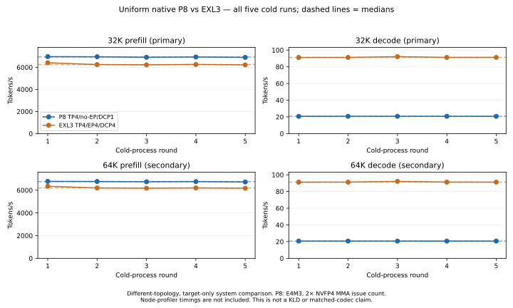

# Uniform native P8 versus EXL3: five cold runs

Decision: **FAIL — allocation game stopped**.

This is a target-only system comparison: P8 TP4/no-EP/DCP1 versus
EXL3 TP4/EP4/DCP4. It is not matched-topology codec causality or
a comparison against production MTP5. Compiled caches remain warm;
each cold run uses a new server container and worker processes.

P8 is E4M3 `mxf8f6f4` m16n8k32: twice the NVFP4 MMA issue count
for equal K, not native P4/NVFP4 speed class.

## Frozen primary decision

median of five P8 cold runs must be strictly greater than median of five EXL3 cold runs for both primary 32K prefill and primary C1 32K decode

| Arm | 32K prefill median tokens/s | C1 32K decode median tokens/s |
|---|---:|---:|
| P8 | 6940.00 | 20.6937 |
| EXL3 | 6252.00 | 91.2645 |

## Every run, including secondary 64K cells

Prefill uses Prometheus-validated server input tokens/s. Decode uses
C1 continuous-usage output tokens/s. Prompt counts are actual, not the
nominal context labels. These rounded values are for display only.

| Round | Arm | Actual prompt tokens 32K / 64K | Prefill 32K / 64K | Decode 32K / 64K | Peak GPU C |
|---:|---|---:|---:|---:|---:|
| 1 | P8 | 32321 / 64511 | 6971.00 / 6780.00 | 20.6430 / 20.6576 | 89 |
| 1 | EXL3 | 32322 / 64514 | 6418.00 / 6349.00 | 91.1988 / 91.1812 | 87 |
| 2 | P8 | 32322 / 64512 | 6959.00 / 6767.00 | 20.7044 / 20.6463 | 87 |
| 2 | EXL3 | 32322 / 64514 | 6252.00 / 6201.00 | 91.2157 / 91.2022 | 89 |
| 3 | P8 | 32322 / 64512 | 6914.00 / 6745.00 | 20.6937 / 20.6433 | 88 |
| 3 | EXL3 | 32324 / 64516 | 6228.00 / 6176.00 | 92.1898 / 92.1231 | 90 |
| 4 | P8 | 32320 / 64510 | 6940.00 / 6760.00 | 20.6953 / 20.6191 | 88 |
| 4 | EXL3 | 32322 / 64514 | 6262.00 / 6204.00 | 91.2645 / 91.2380 | 89 |
| 5 | P8 | 32320 / 64510 | 6904.00 / 6727.00 | 20.6679 / 20.6584 | 89 |
| 5 | EXL3 | 32322 / 64514 | 6224.00 / 6175.00 | 91.3046 / 91.2028 | 90 |

## Evidence and limits

The receipt audit verifies ten distinct containers, chronological run order,
within-arm configuration stability, graph/backend/dispatch evidence, hashes,
and thermal limits. The five repeats measure serving-process variation for
one prepared checkpoint, not independent quantization-pipeline replicates.

Full-model KLD was measured separately at 0.04002139481676188 on the
32 conditional-fit windows, in eager FP8-MLA-KV serving. This graph/NVFP4-KV
speed test does not establish quality parity for its different serving regime.
The earlier 24.96% contextual KLD decrease is not a matched NVFP4 win.

Frozen plan SHA-256: `5ac7be9078969028263a8321ad377297290be4395f6bfeb27baccce41483022c`.

Reproduction inputs: `analysis.json`, `speed-receipt-audit.json`, per-run
`benchmark.json` and receipts in the terminal speed-v2a3 evidence snapshot.
Failures and amended attempts remain in `P8_SPEED_ATTEMPTS.md`.

Existing ExLlamaV3, KQuant, QSRT and w4a8_trellis attribution applies.

